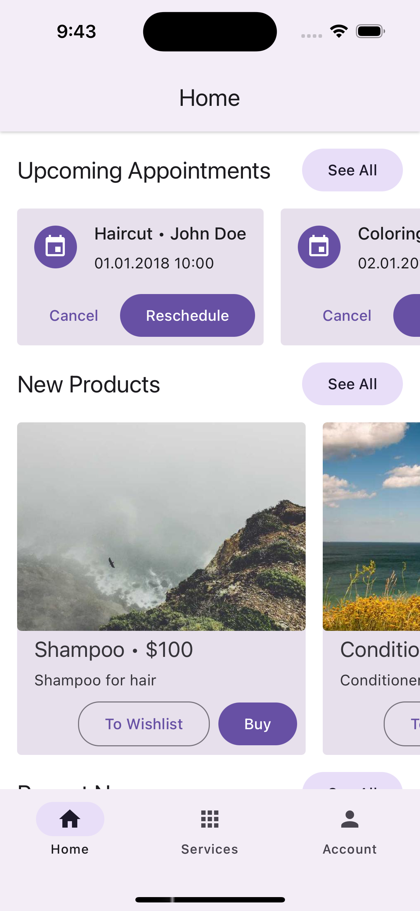
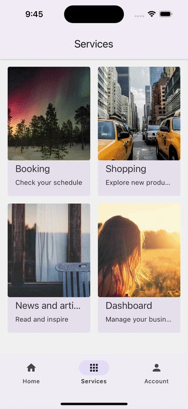

<a href="https://www.callstack.com/open-source?utm_campaign=generic&utm_source=github&utm_medium=referral&utm_content=super-app-showcase" align="center">
  
</a>
<h3 align="center">Super Apps in React Native with Re.Pack</h3>
<div align="center">

[![mit licence][license-badge]][license]
[![Chat][chat-badge]][chat]
[![PRs Welcome][prs-welcome-badge]][prs-welcome]

</div>

<table>
<tr>
<td width="50%" valign="top">

### 🇬🇧 English

Bring **micro-frontend architecture** to your mobile [React Native](https://reactnative.dev) app with [Re.Pack](https://re-pack.dev) and make it a **Super App**. [Learn more.](https://www.callstack.com/services/super-app-development?utm_campaign=super_apps&utm_source=github&utm_content=super_app_showcase)

</td>
<td width="50%" valign="top">

### 🇻🇳 Tiếng Việt

Đưa **kiến trúc micro-frontend** vào ứng dụng di động [React Native](https://reactnative.dev) của bạn với [Re.Pack](https://re-pack.dev) và biến nó thành một **Super App**. [Tìm hiểu thêm.](https://www.callstack.com/services/super-app-development?utm_campaign=super_apps&utm_source=github&utm_content=super_app_showcase)

</td>
</tr>
</table>

---

<table>
<tr>
<td width="50%" valign="top">

## The Problem

As apps grow to offer multiple services — payments, messaging, social networking, gaming, news, and more — maintaining a single codebase becomes increasingly difficult. The codebase can become cluttered, build times increase, and the app size may deter users who only need a few services.

Traditional approaches like **monorepos** or **npm packages** help draw boundaries between features, but they have drawbacks: monorepos still produce a single large bundle, and npm packages require version coordination and redeployment for every update.

Meanwhile, web teams have long benefited from **micro-frontend architecture**, which allows splitting an app into smaller, independently deployable parts that can be loaded on demand. This project brings that same capability to React Native.

</td>
<td width="50%" valign="top">

## Vấn đề

Khi ứng dụng phát triển để cung cấp nhiều dịch vụ — thanh toán, nhắn tin, mạng xã hội, trò chơi, tin tức, v.v. — việc duy trì một codebase duy nhất ngày càng khó khăn. Codebase trở nên lộn xộn, thời gian build tăng lên, và kích thước ứng dụng có thể khiến người dùng chỉ cần vài dịch vụ phải e ngại.

Các phương pháp truyền thống như **monorepo** hoặc **npm package** giúp phân tách các tính năng, nhưng có nhược điểm: monorepo vẫn tạo ra một bundle lớn duy nhất, và npm package yêu cầu phối hợp phiên bản và triển khai lại cho mỗi lần cập nhật.

Trong khi đó, các đội ngũ web từ lâu đã tận dụng **kiến trúc micro-frontend**, cho phép chia ứng dụng thành các phần nhỏ hơn, triển khai độc lập và có thể tải theo yêu cầu. Dự án này mang khả năng tương tự đến React Native.

</td>
</tr>
</table>

<table>
<tr>
<td width="50%" valign="top">

## The Solution

This showcase demonstrates how to build a proper **micro-frontend architecture** for mobile apps using [Module Federation](https://module-federation.io) — a runtime module sharing system originally popularized by webpack.

**Key benefits:**

- **Independent deployment** — Each mini app can be developed, tested, and deployed separately, or as part of the super app.
- **Separate repositories** — Micro-frontends can live in different repos, enabling independent team workflows and external contributions.
- **Runtime dependencies** — Unlike classic monorepos, updating a micro-frontend automatically updates all consuming apps **without redeployment** of the host.
- **On-demand loading** — Mini apps are loaded at runtime, reducing initial bundle size and improving startup performance.
- **Shared dependencies** — Common libraries (React, React Native, etc.) are shared across micro-frontends to avoid duplication.

</td>
<td width="50%" valign="top">

## Giải pháp

Dự án này minh họa cách xây dựng **kiến trúc micro-frontend** hoàn chỉnh cho ứng dụng di động sử dụng [Module Federation](https://module-federation.io) — một hệ thống chia sẻ module runtime, ban đầu được phổ biến bởi webpack.

**Lợi ích chính:**

- **Triển khai độc lập** — Mỗi mini app có thể được phát triển, kiểm thử và triển khai riêng biệt, hoặc là một phần của super app.
- **Tách biệt repository** — Các micro-frontend có thể nằm ở các repo khác nhau, cho phép các đội ngũ làm việc độc lập và đóng góp từ bên ngoài.
- **Phụ thuộc runtime** — Khác với monorepo truyền thống, cập nhật một micro-frontend sẽ tự động cập nhật tất cả các ứng dụng sử dụng nó **mà không cần triển khai lại** host.
- **Tải theo yêu cầu** — Các mini app được tải tại runtime, giảm kích thước bundle ban đầu và cải thiện hiệu suất khởi động.
- **Chia sẻ dependency** — Các thư viện chung (React, React Native, v.v.) được chia sẻ giữa các micro-frontend để tránh trùng lặp.

</td>
</tr>
</table>

## The Super App / Ứng dụng Super App

<table>
  <tr>
    <td>Host App</td>
    <td>Mini Apps Interaction</td>
    <td>Booking Standalone App</td>
  </tr>
  <tr>
    <td></td>
    <td></td>
    <td></td>
  </tr>
</table>

## Structure / Cấu trúc


<table>
<tr>
<td width="50%" valign="top">

The super app contains the following packages:

- **`host`** — The main super app container. It loads all micro-frontends and provides navigation between them.
- **`booking`** — Micro-frontend for the booking service. Exposes `UpcomingAppointments` screen (used by the host in its own navigation) and `MainNavigator` (the full Booking app).
- **`shopping`** — Micro-frontend for the shopping service. Exposes `MainNavigator` (the full Shopping app).
- **`news`** — Micro-frontend for the news service. Exposes `MainNavigator`. Stored in a [separate repository](https://github.com/callstack/news-mini-app-showcase) to demonstrate using a remote container outside of the monorepo.
- **`dashboard`** — Micro-frontend for the dashboard service. Exposes `MainNavigator` (the full Dashboard app).
- **`auth`** — Shared module providing authentication/authorization logic and UI (e.g., `SignInScreen`, `AccountScreen`) used by all other modules.

Each mini app can be deployed and run as a standalone app.

</td>
<td width="50%" valign="top">

Super app bao gồm các package sau:

- **`host`** — Ứng dụng super app chính. Tải tất cả các micro-frontend và cung cấp điều hướng giữa chúng.
- **`booking`** — Micro-frontend cho dịch vụ đặt lịch. Cung cấp màn hình `UpcomingAppointments` (được host sử dụng trong điều hướng riêng) và `MainNavigator` (toàn bộ ứng dụng Booking).
- **`shopping`** — Micro-frontend cho dịch vụ mua sắm. Cung cấp `MainNavigator` (toàn bộ ứng dụng Shopping).
- **`news`** — Micro-frontend cho dịch vụ tin tức. Cung cấp `MainNavigator`. Được lưu trữ trong [repository riêng biệt](https://github.com/callstack/news-mini-app-showcase) để minh họa việc sử dụng remote container ngoài monorepo.
- **`dashboard`** — Micro-frontend cho dịch vụ quản lý. Cung cấp `MainNavigator` (toàn bộ ứng dụng Dashboard).
- **`auth`** — Module dùng chung cung cấp logic xác thực/ủy quyền và giao diện (ví dụ: `SignInScreen`, `AccountScreen`) được sử dụng bởi tất cả các module khác.

Mỗi mini app có thể được triển khai và chạy như một ứng dụng độc lập.

</td>
</tr>
</table>

## How to Use / Cách sử dụng

<table>
<tr>
<td width="50%" valign="top">

### Requirements

⚠️ **Important:** This project requires:

- **Node.js** version 22 or higher
- **pnpm** as package manager

Please refer to the official [pnpm installation guide](https://pnpm.io/installation) for detailed setup instructions.

After installation, it's recommended to align your pnpm version with the project:

```bash
pnpm self-update
```

</td>
<td width="50%" valign="top">

### Yêu cầu

⚠️ **Quan trọng:** Dự án này yêu cầu:

- **Node.js** phiên bản 22 trở lên
- **pnpm** làm trình quản lý package

Vui lòng tham khảo [hướng dẫn cài đặt pnpm](https://pnpm.io/installation) chính thức để biết chi tiết.

Sau khi cài đặt, nên cập nhật phiên bản pnpm phù hợp với dự án:

```bash
pnpm self-update
```

</td>
</tr>
</table>

<table>
<tr>
<td width="50%" valign="top">

### Setup

Install dependencies for all apps:

```
pnpm install
```

#### iOS

In case automatic pods installation doesn't work when running iOS project, you can install manually:

```
pnpm pods
```

</td>
<td width="50%" valign="top">

### Cài đặt

Cài đặt dependency cho tất cả ứng dụng:

```
pnpm install
```

#### iOS

Trong trường hợp cài đặt pods tự động không hoạt động khi chạy dự án iOS, bạn có thể cài đặt thủ công:

```
pnpm pods
```

</td>
</tr>
</table>

<table>
<tr>
<td width="50%" valign="top">

### Running the Super App

Start DevServer for Host and Mini apps:

```
pnpm start
```

Run Super App on iOS or Android (ios | android):

```
pnpm run:host:<platform>
```

### Running the Mini App as a standalone app

> **💡 NOTE**
>
> The "booking" and "shopping" mini-apps can't be run in standalone mode (i.e. without the host running). This is a deliberate decision of this repository to showcase the possibility and to reduce the amount of work to keep the mini-apps dependencies up-to-date.
>
> It's up to you to decide on what kind of developer experience your super app has.

Start DevServer for a Dashboard Mini App as a standalone app:

```
pnpm start:dashboard
```

</td>
<td width="50%" valign="top">

### Chạy Super App

Khởi động DevServer cho Host và các Mini app:

```
pnpm start
```

Chạy Super App trên iOS hoặc Android (ios | android):

```
pnpm run:host:<platform>
```

### Chạy Mini App như ứng dụng độc lập

> **💡 LƯU Ý**
>
> Các mini-app "booking" và "shopping" không thể chạy ở chế độ độc lập (tức là không có host chạy). Đây là quyết định có chủ đích của repository này để minh họa khả năng và giảm khối lượng công việc duy trì dependency của các mini-app.
>
> Bạn tự quyết định trải nghiệm phát triển cho super app của mình.

Khởi động DevServer cho Dashboard Mini App như ứng dụng độc lập:

```
pnpm start:dashboard
```

</td>
</tr>
</table>

<table>
<tr>
<td width="50%" valign="top">

### Code Quality Scripts

Run tests for all apps:

```
pnpm test
```

Run linter for all apps:

```
pnpm lint
```

Run type check for all apps:

```
pnpm typecheck
```

</td>
<td width="50%" valign="top">

### Kiểm tra chất lượng code

Chạy test cho tất cả ứng dụng:

```
pnpm test
```

Chạy linter cho tất cả ứng dụng:

```
pnpm lint
```

Chạy kiểm tra kiểu dữ liệu cho tất cả ứng dụng:

```
pnpm typecheck
```

</td>
</tr>
</table>

<table>
<tr>
<td width="50%" valign="top">

## Contributing

Read the [contribution guidelines](/CONTRIBUTING.md) before contributing.

## Made with ❤️ at Callstack

Super App showcase is an open source project and will always remain free to use. If you think it's cool, please star it 🌟. [Callstack][callstack-readme-with-love] is a group of React and React Native geeks, contact us at [hello@callstack.com](mailto:hello@callstack.com) if you need any help with these or just want to say hi!

</td>
<td width="50%" valign="top">

## Đóng góp

Đọc [hướng dẫn đóng góp](/CONTRIBUTING.md) trước khi đóng góp.

## Được tạo với ❤️ tại Callstack

Super App showcase là một dự án mã nguồn mở và sẽ luôn miễn phí để sử dụng. Nếu bạn thấy hay, hãy star 🌟 nhé. [Callstack][callstack-readme-with-love] là một nhóm những người đam mê React và React Native, liên hệ chúng tôi tại [hello@callstack.com](mailto:hello@callstack.com) nếu bạn cần hỗ trợ hoặc chỉ muốn chào hỏi!

</td>
</tr>
</table>

<!-- badges -->

[callstack-readme-with-love]: https://callstack.com/?utm_source=github.com&utm_medium=referral&utm_campaign=super-app-showcase&utm_term=readme-with-love
[license-badge]: https://img.shields.io/github/license/callstack/super-app-showcase?style=for-the-badge
[license]: https://github.com/callstack/super-app-showcase/blob/main/LICENSE
[prs-welcome-badge]: https://img.shields.io/badge/PRs-welcome-brightgreen.svg?style=for-the-badge
[prs-welcome]: ./CONTRIBUTING.md
[chat-badge]: https://img.shields.io/discord/426714625279524876.svg?style=for-the-badge
[chat]: https://discord.gg/Q4yr2rTWYF
